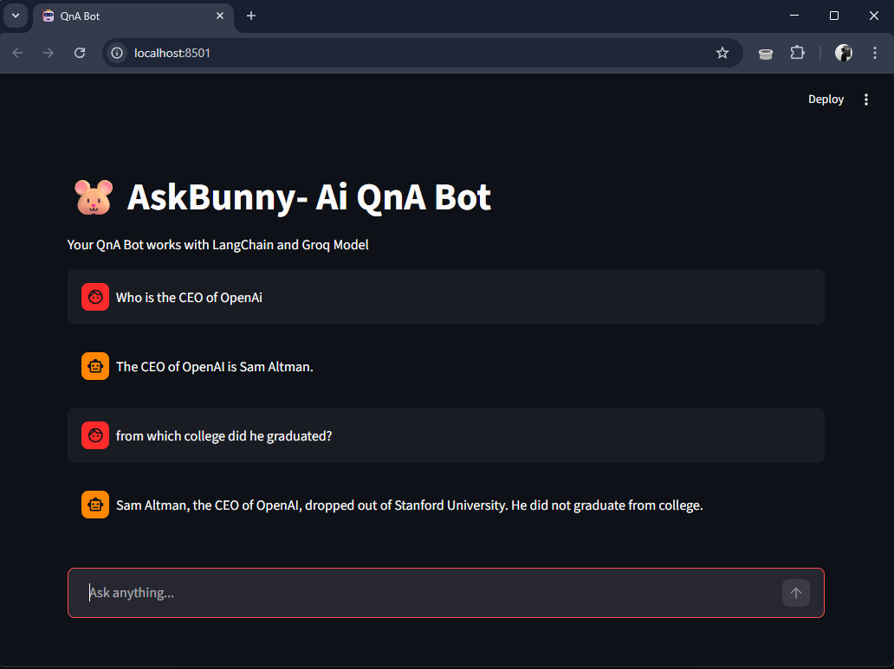

# 🐹 AskBunny AI

### ⚡ Conversational QnA Bot

## 📸 Demo

  

  
  

---

## 🚀 Overview

**AskBunny AI** is a  conversational assistant built using **Groq’s ultra-fast LPU inference** and **LangChain orchestration**.

It delivers:

* 🧠 **Context-aware conversations**
* 🎨 **Clean, modern chat UI**

---

## ✨ Features

* 🧠 **Contextual Memory**
  Remembers previous messages for natural conversations

* 🎨 **Modern UI/UX**
  Built with Streamlit chat components

* 🔐 **Secure Configuration**
  Uses `python-dotenv` to protect API keys

---

## 🛠️ Tech Stack

| Layer         | Technology     |
| ------------- | -------------- |
| Frontend      | Streamlit      |
| Orchestration | LangChain      |
| Inference     | Groq Cloud     |
| Model         | Llama 3.3      |
| Env           | Conda + Dotenv |

---

## ⚙️ How It Works

### 🗂️ Session Persistence

* Uses `st.session_state` to store chat history

### 💬 Message Flow

* Each user input is appended to the message list

### 🔄 Context Injection

* Entire conversation is sent to the model
* Enables follow-up understanding like:

  > “Who is he?”

### 🎭 Smart Rendering

* Dynamically renders:

  * User messages
  * AI responses

